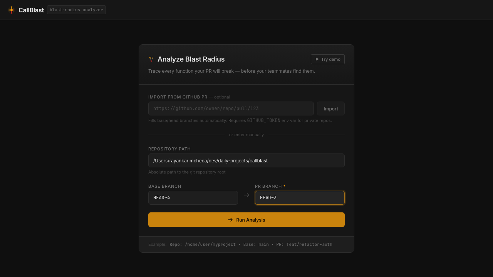
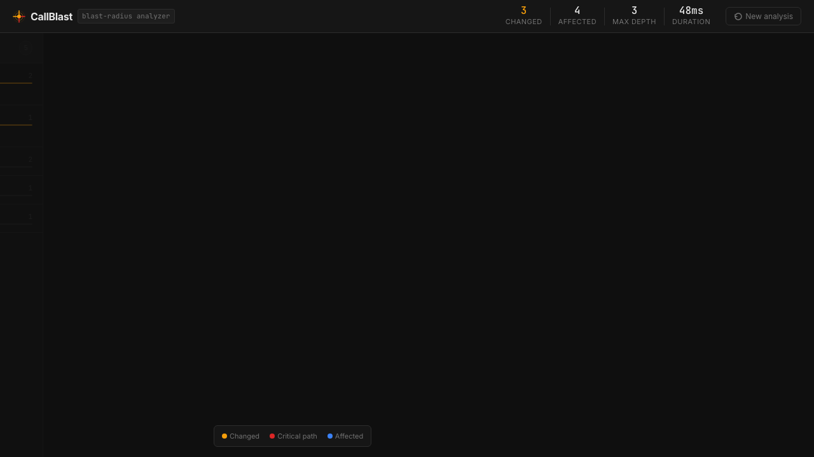
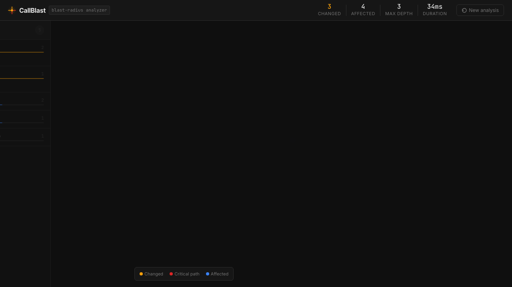
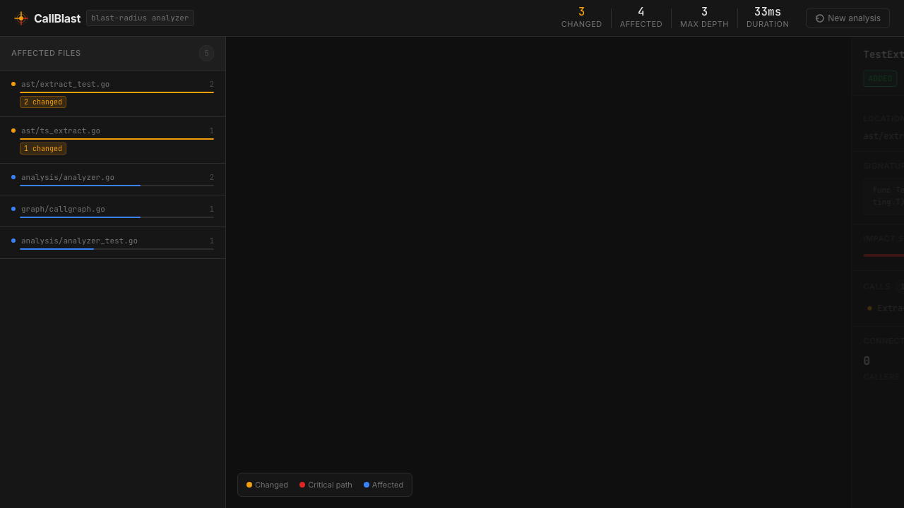
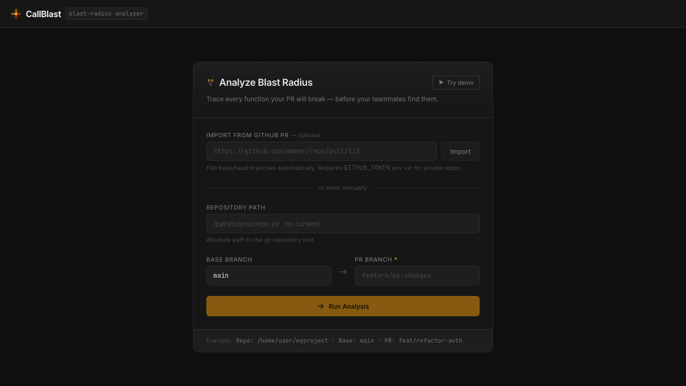

# CallBlast

**Finds every function your PR will actually break before your teammates do.**

[](https://github.com/rayancheca/callblast/actions/workflows/ci.yml)
[](https://go.dev)
[](https://typescriptlang.org)
[](LICENSE)

Code reviewers see line diffs. CallBlast sees impact. A one-line signature change in a shared utility can silently break dozens of callers across the codebase — with no warning in the PR diff. CallBlast parses both sides of your PR with Go's native AST, constructs a full call graph over the entire repository, and traces the transitive blast radius of every semantic change before the branch merges.

## Screenshots

### 1 — Fill in the form

Enter your repo path and branch names. Or paste a GitHub PR URL to auto-fill, or click **Try demo** to analyze this repo's own last commit.



### 2 — Analysis completes (33ms on this repo)

The server runs git diff → AST extraction → semantic diff → call graph construction → BFS reachability in a single pipeline and streams results over WebSocket.



### 3 — Affected files ranked by severity

The left sidebar ranks every affected file by function count and severity (amber = changed origin, red = critical path, blue = transitively affected).



### 4 — Click any node for full detail

Click a node to see its signature, file location, depth score, impact badge, and its full list of direct callers and callees.



### 5 — Reset for a new analysis

Hit **New analysis** in the header to go back to the form.



## What it does

You give it a repo path, a base branch, and a PR branch. It gives you an interactive force-directed graph of every function that will be affected — scored by impact depth, highlighted by severity, and explorable by click.

```
callblast — Analyze PR blast radius
  Repo:   /path/to/your/repo
  Base:   main
  Head:   feat/refactor-auth
  
  Found 3 changed functions
  Blast radius: 17 affected callers across 6 files
  Critical path: 4 nodes reachable from 2+ changes
  Duration: 142ms
```

## Architecture

```
[Web UI — React + D3]
       ↕ WebSocket
[HTTP Server — Go]
       │
       ├── [Git Integration]   git diff, git show, git ls-files
       │
       ├── [AST Extractor]     go/ast → FunctionDef{name, sig, bodyHash}
       │                       regex  → TypeScript / class method extraction
       │
       ├── [Semantic Diff]     compare function versions across base/head
       │                       classify: ADDED | REMOVED | SIG_CHANGED | BODY_CHANGED | RENAMED
       │
       ├── [Call Graph]        directed adjacency map of all function calls
       │                       resolves short names to qualified file::funcName
       │                       TypeScript: emits qualified obj.method callee names
       │
       └── [BFS Reachability]  transitive closure from changed functions
                               scores nodes by depth + critical-path membership
```

## Technical deep-dive

### Why go/ast instead of tree-sitter

The standard Go `go/ast` package gives us richer semantic information than tree-sitter for Go specifically — method receivers, type resolution, and clean position data. It requires no CGO, no compiled grammar binaries, and handles all of Go's syntax edge cases. For TypeScript we use a regex-heuristic approach: less precise, but sufficient for identifying function boundaries and call sites across the three common forms (function declarations, arrow functions, and class methods).

### The blast radius algorithm

Semantic diff compares function definitions by qualified name (`file::Type.method` or `file::function`). If a function exists in both base and head, we compare its signature and body hash (SHA-1 of the body text). Renames are detected by matching body hashes across files — if a function disappeared and a new function appeared with the same body hash, it was renamed.

The call graph is a directed adjacency map: `caller → []callees`, with a parallel reverse map `callee → []callers`. Short names like `validateInput` are resolved to qualified names using a short-name index built during graph construction, preferring same-file resolution on ambiguity. TypeScript method calls (`obj.method()`) are stored as qualified call sites to distinguish `service1.save()` from `service2.save()` without full type inference.

BFS runs backwards through the reverse graph from each changed function. A node's impact score is `1 / (depth + 1)^0.7` — decaying with distance but sub-linearly, so third-level callers still show meaningful impact. Nodes reachable from two or more changed functions are marked "critical path" and rendered in red.

### Why stream via WebSocket

Call graph construction over a large repo (10,000+ files) takes time. Streaming events as they're discovered means the D3 graph starts rendering immediately with changed functions, then populates outward as BFS explores. The server buffers events in memory so late WebSocket connections can replay the full session. A concurrency semaphore caps simultaneous analyses at 10 and a 2-minute timeout prevents runaway jobs.

## Install

**Prerequisites:** Go 1.22+, Node.js 18+

```bash
git clone https://github.com/rayancheca/callblast
cd callblast
make build
```

Or manually:

```bash
# Build Go backend
go build -o callblast ./cmd/callblast

# Build React frontend
cd web && npm install && npm run build && cd ..
```

## Run

```bash
./callblast
# Opens http://localhost:7332
```

Or with the `--demo` flag to auto-open the browser:

```bash
./callblast --demo
```

Or run frontend separately in development:

```bash
# Terminal 1: backend
./callblast --port 7332 --static=""

# Terminal 2: frontend with hot reload
cd web && npm run dev
# Open http://localhost:5173
```

All Makefile targets:

```bash
make build    # build frontend + Go binary
make test     # go test -race ./...
make dev      # build, start backend, start Vite dev server
make run      # build + run on default port
make clean    # remove binary and web/dist
```

## Usage

1. Open `http://localhost:7332`
2. **Option A:** Paste a GitHub PR URL in the "Import from GitHub PR" field and click **Import** — base and head branches auto-fill (set `GITHUB_TOKEN` for private repos)
3. **Option B:** Enter your repo path, base branch, and PR branch manually
4. **Option C:** Click **Try demo** to run the analysis on this repo's own last commit
5. Click **Run Analysis**

The graph streams in live as analysis runs:
- **Amber nodes** — functions that changed in the PR (origin of blast)
- **Red nodes** — critical-path functions reachable from two or more changed functions
- **Blue nodes** — transitively affected callers
- Click any node for full detail: signature, location, callers, callees, impact score
- Left sidebar ranks affected files by maximum impact score
- Drag nodes to reorganize; scroll to zoom; click background to deselect

## Supported languages

| Language | Function extraction | Call site extraction |
|----------|--------------------|--------------------|
| Go       | Full (go/ast)      | Full (AST-accurate) |
| TypeScript / JavaScript | Functions, arrow functions, class methods | Qualified method calls + plain calls |

## Run tests

```bash
# Go unit tests (with race detector)
go test -race ./...

# E2E tests (requires built binary)
make build
cd web && npx playwright test
```

## License

MIT
